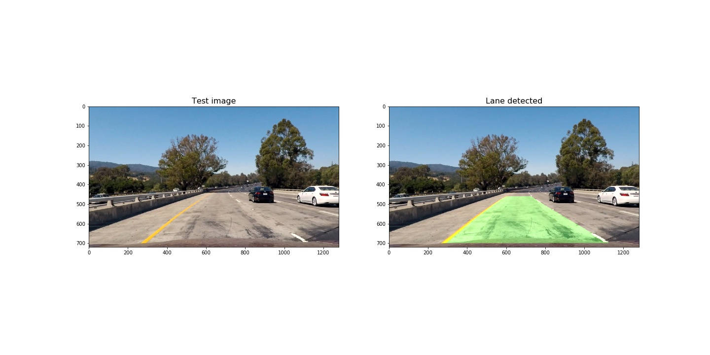

# Self-Driving Car Engineer Nanodegree

## **Advanced Lane Finding** 


---

## Overview

In this project, a software pipeline was implemented to detect the lane positions in a video from a front-facing camera on a car. 


## Goals/Steps

The pipeline consists of 9 steps:

1. Compute the camera calibration matrix and distortion coefficients given a set of chessboard images,
2. Apply a distortion correction to raw images,
3. Use color transforms, gradients, etc., to create a thresholded binary image,
4. Apply a perspective transform to rectify binary image ("birds-eye view"),
5. Detect lane pixels and fit to find the lane boundary,
6. Determine the curvature of the lane, and vehicle position with respect to center,
7. Warp the detected lane boundaries back onto the original image,
8. Display lane boundaries and numerical estimation of lane curvature and vehicle position,
9. Run pipeline in a video.


### Step 1: Compute the camera calibration using chessboard images

The next step is to perform a camera calibration. A set of chessboard images will be used for this purpose.

The `calibrate_camera` function takes as input parameters an array of paths to chessboards images, and the number of inside corners in the _x_ and _y_ axis.


### Step 2: Apply a distortion correction to raw images

Another OpenCv funtion, [cv2.undistort](https://docs.opencv.org/3.0-beta/doc/py_tutorials/py_calib3d/py_calibration/py_calibration.html), will be used to undistort images.

It can be observed the result of undistorting one of the chessboard images:


### Step 3: Use color transforms, gradients, etc., to create a thresholded binary image.

In this step, the following funtions are used to calculate several gradient measurements (x, y, magnitude, direction and color).

- Calculate directional gradient: `abs_sobel_thresh()`.
- Calculate gradient magnitude: `mag_thres()`.
- Calculate gradient direction: `dir_thresh()`.
- Calculate color threshold: `col_thresh()`.

Then, `combine_threshs()` will be used to combine these thresholds, and produce the image which will be used to identify lane lines in later steps.

Please see the following result of applying each function to a sample image:

- Calculate directional gradient for _x_ and _y_ orients:


- Calculate gradient magnitude 


- Calculate gradient direction 


- Calculate color threshold


The output image resulting of combining each thresh can be observed below:

 


### Step 4: Apply a perspective transform to rectify binary image ("birds-eye view").

The next step in our pipeline is to transform our sample image to _birds-eye_ view.

The process to do that is quite simple:

- First, you need to select the coordinates corresponding to a [trapezoid](https://en.wikipedia.org/wiki/Trapezoid) in the image, but which would look like a rectangle from _birds_eye_ view.
- Then, you have to define the destination coordinates, or how that trapezoid would look from _birds_eye_ view. 
- Finally, Opencv function [cv2.getPerspectiveTransform](https://docs.opencv.org/2.4/modules/imgproc/doc/geometric_transformations.html#getperspectivetransform) will be used to calculate both, the perpective transform _M_ and the inverse perpective transform _Minv.
- _M_ and _Minv_ will be used respectively to warp and unwarp the video images.

Please find below the result of warping an image after transforming its perpective to birds-eye view:


The code for the `warp()` function can be found below:

```python
# Define perspective transform function
def warp(img, src_coordinates=None, dst_coordinates=None):
    # Define calibration box in source (original) and destination (desired or warped) coordinates
    img_size = (img.shape[1], img.shape[0])
    
    
    if src_coordinates is None:
        src_coordinates = np.float32(
            [[280,  700],  # Bottom left
             [595,  460],  # Top left
             [725,  460],  # Top right
             [1125, 700]]) # Bottom right
        
    if dst_coordinates is None:
        dst_coordinates = np.float32(
            [[250,  720],  # Bottom left
             [250,    0],  # Top left
             [1065,   0],  # Top right
             [1065, 720]]) # Bottom right   

    # Compute the perspective transfor, M
    M = cv2.getPerspectiveTransform(src_coordinates, dst_coordinates)

    
    # Compute the inverse perspective transfor also by swapping the input parameters
    Minv = cv2.getPerspectiveTransform(dst_coordinates, src_coordinates)
    
    # Create warped image - uses linear interpolation
    warped = cv2.warpPerspective(img, M, img_size, flags=cv2.INTER_LINEAR)

    return warped, M, Minv
```


### Step 5: Detect lane pixels and fit to find the lane boundary.

 In order to detect the lane pixels from the warped image, the following steps are performed.
 
 - First, a histogram of the lower half of the warped image is created. 


```python
def get_histogram(img):
    return np.sum(img[img.shape[0]//2:, :], axis=0)

# Run de function over the combined warped image
combined_warped = warp(combined)[0]
histogram = get_histogram(combined_warped)

# Plot the results
plt.title('Histogram', fontsize=16)
plt.xlabel('Pixel position')
plt.ylabel('Counts')
plt.plot(histogram)
```

- Then, the starting left and right lanes positions are selected by looking to the max value of the histogram to the left and the right of the histogram's mid position.
- A technique known as _Sliding Window_ is used to identify the most likely coordinates of the lane lines in a window, which slides vertically through the image for both the left and right line.
- Finally, usign the coordinates previously calculated, a second order polynomial is calculated for both the left and right lane line. 

Please find below the result of applying the `detect_lines()` function to the warped image:


Once you have selected the lines, it is reasonable to assume that the lines will remain there in future video frames.
`detect_similar_lines()` uses the previosly calculated _line_fits_ to try to identify the lane lines in a consecutive image. If it fails to calculate it, it invokes `detect_lines()` function to perform a full search.


### Step 6: Determine the curvature of the lane, and vehicle position with respect to center.

The radius of curvature and the car offset is calculated as follows.

```python
def curvature_radius (leftx, rightx, img_shape, xm_per_pix=3.7/800, ym_per_pix = 25/720):
    ploty = np.linspace(0, img_shape[0] - 1, img_shape[0])
    
    leftx = leftx[::-1]  # Reverse to match top-to-bottom in y
    rightx = rightx[::-1]  # Reverse to match top-to-bottom in y
    
    # Fit a second order polynomial to pixel positions in each fake lane line
    left_fit = np.polyfit(ploty, leftx, 2)
    left_fitx = left_fit[0]*ploty**2 + left_fit[1]*ploty + left_fit[2]
    right_fit = np.polyfit(ploty, rightx, 2)
    right_fitx = right_fit[0]*ploty**2 + right_fit[1]*ploty + right_fit[2]

    # Define conversions in x and y from pixels space to meters
    ym_per_pix = 25/720 # meters per pixel in y dimension
    xm_per_pix = 3.7/800 # meters per pixel in x dimension

    # Fit new polynomials to x,y in world space
    y_eval = np.max(ploty)
    left_fit_cr = np.polyfit(ploty*ym_per_pix, leftx*xm_per_pix, 2)
    right_fit_cr = np.polyfit(ploty*ym_per_pix, rightx*xm_per_pix, 2)
    
    # Calculate the new radii of curvature
    left_curverad = ((1 + (2*left_fit_cr[0]*y_eval*ym_per_pix + left_fit_cr[1])**2)**1.5) / np.absolute(2*left_fit_cr[0])
    right_curverad = ((1 + (2*right_fit_cr[0]*y_eval*ym_per_pix + right_fit_cr[1])**2)**1.5) / np.absolute(2*right_fit_cr[0])
    
    # Now our radius of curvature is in meters
    return (left_curverad, right_curverad)
```

```python
def car_offset(leftx, rightx, img_shape, xm_per_pix=3.7/800):
    ## Image mid horizontal position 
    mid_imgx = img_shape[1]//2
        
    ## Average lane horizontal position
    mid_lanex = (np.mean((leftx + rightx)/2))
    
    ## Horizontal car offset 
    offsetx = (mid_imgx - mid_lanex) * xm_per_pix

    return offsetx
```

### Step 7: Warp the detected lane boundaries back onto the original image.

We have identified the lane lines, its radius of curvature and the car offset.

The next step is to draw the lanes on the original image:

- First, we will draw the lane lines onto the warped blank version of the image.
- The lane will be drawn onto the warped blank image using the Opencv function.  
- Finally, the blank will be warped back to original image space using inverse perspective matrix.

Its output can be founded below:




### Step 8: Display lane boundaries and numerical estimation of lane curvature and vehicle position.

The next step is to add metrics to the image. A method named `add_metrics()` was created to receive an image and the line points and returns an image which contains the left and right lane lines radius of curvature and the car offset. 

This function makes use of the previously defined `curvature_radius()` and `car_offset()` function.

Please find below the output image after invoking `add_metrics`:


### Step 9: Run pipeline in a video.

In this step, a pipeline was created to run on a video.

The first thing is to create the `ProcessImage` class. 

The sanity checks or lines smoothing is not implemented yet. 

Finally, the output video was generated.

```python
input_video = './project_video.mp4'
output_video = './project_video_solution.mp4'

## You may uncomment the following line for a subclip of the first 5 seconds
#clip1 = VideoFileClip(input_video).subclip(0,5)
clip1 = VideoFileClip(input_video)

# Process video frames with our 'process_image' function
process_image = ProcessImage('./camera_cal/calibration*.jpg')

white_clip = clip1.fl_image(process_image)

%time white_clip.write_videofile(./writeup_imgs/output_video, audio=False)
```

The output video can be found [here](./project_video_solution.mp4). 

---
## Discussion


There are some improvements which can be considered for the future.

- Perform sanity checks 
  - Checking that they have similar curvature,
  - Checking that they are separated by the right distance horizontally
  - Checking that they are roughly parallel.
  
- Perform Smoothing
  - The last n frames can be used to obtain a smoother result. Each time a new high-confidence measurement is calculated, it can be appended  to the list of recent measurements and then take an average over n past measurements to calculate the lane position.


